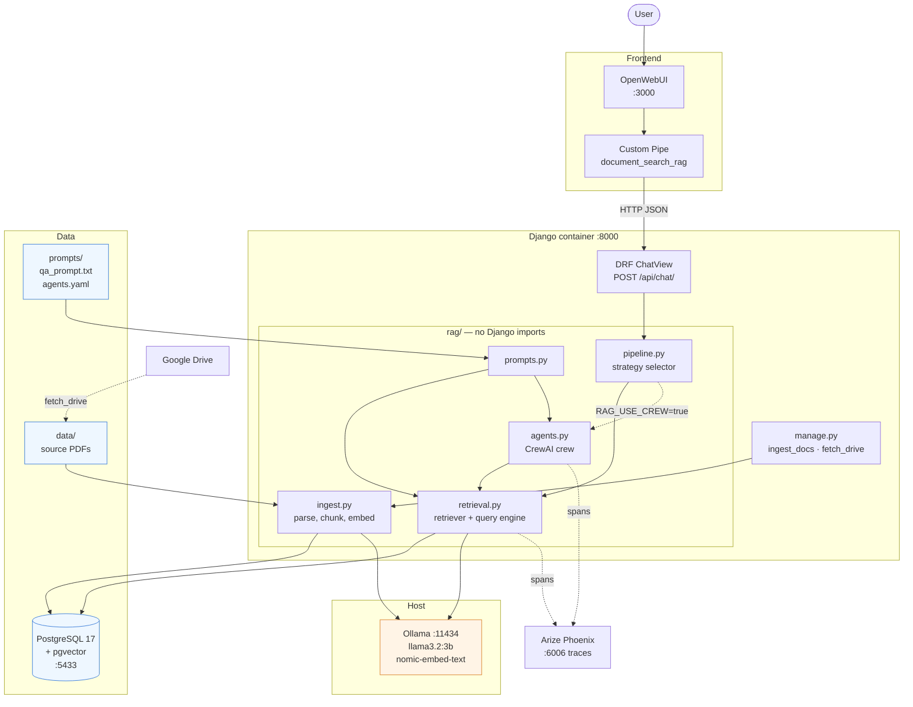
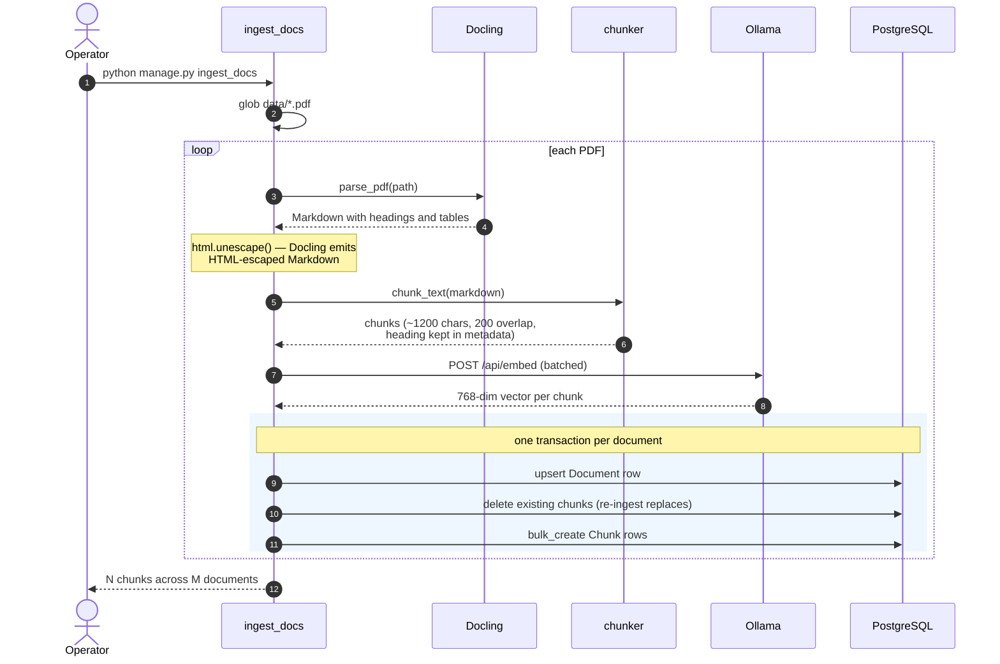
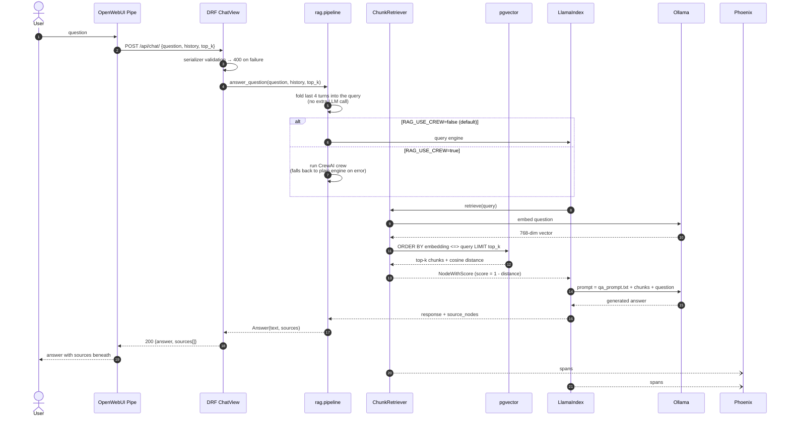
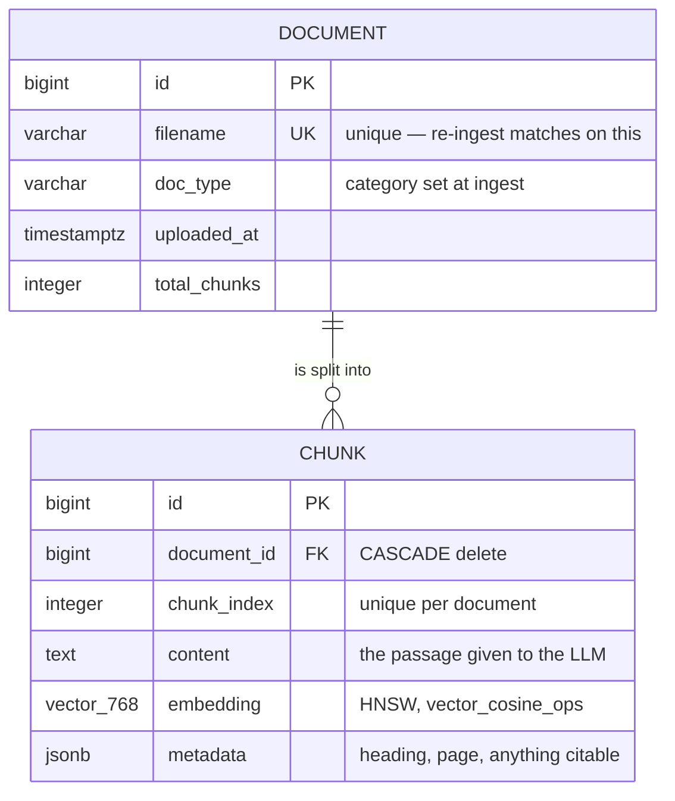
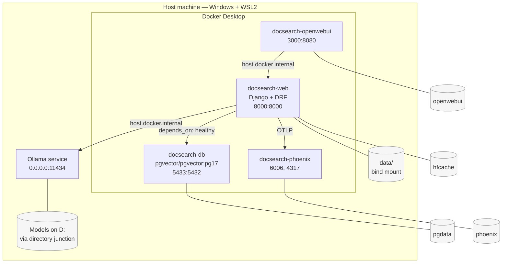

# Solution Architecture

Document Search Platform — an Agentic RAG backend over a corpus of PDFs, exposed
as a REST API and driven from an OpenWebUI chat frontend.

Diagrams are Mermaid, so they render directly on GitHub and in most Markdown
viewers.

---

## 1. System architecture

Five runtime components. Four are containers; **Ollama runs natively on the
host** — see [DESIGN_DECISIONS.md](DESIGN_DECISIONS.md#4-ollama-runs-on-the-host-not-in-compose).




**Solid arrows** are the request path. **Dotted arrows** are optional or
out-of-band: the crew is opt-in, Drive fetching is manual, and tracing is
fire-and-forget.

### Component responsibilities


| Component             | Responsibility                                                    | Key constraint                                            |
| --------------------- | ----------------------------------------------------------------- | --------------------------------------------------------- |
| OpenWebUI + Pipe      | Chat UI; forwards question, history, and `top_k`; renders sources | Installed into OpenWebUI's SQLite so it survives restarts |
| DRF `ChatView`        | Validate input, call one function, serialize the result           | Deliberately thin — no RAG logic                          |
| `rag/pipeline.py`     | Choose crew or plain engine; fall back on error                   | The only module the API imports                           |
| `rag/retrieval.py`    | Vector search + LlamaIndex synthesis                              | Reads Postgres via psycopg, not the ORM                   |
| `rag/agents.py`       | Two-agent CrewAI crew over a retrieval tool                       | Off by default                                            |
| `rag/ingest.py`       | Docling parse → chunk → embed                                     | Runs in a command, never in a view                        |
| PostgreSQL + pgvector | Chunks, embeddings, similarity search                             | Schema owned by Django migrations                         |
| Ollama                | Embeddings and generation                                         | Native on host; models on a separate disk                 |
| Phoenix               | Trace collection and UI                                           | Failures are swallowed by design                          |


---


## 2. Ingestion flow

Offline, via `manage.py ingest_docs`. Not exposed over HTTP — embedding a
document takes far longer than any request should.




**Why one transaction per document:** a failure part-way through a batch leaves
the catalog consistent rather than half-indexed. Re-ingesting *replaces* a
document's chunks rather than appending, so `chunk_index` stays unique and stale
text cannot linger in search results.

---


## 3. Query flow

Synchronous. The connection is held until the answer is complete.




Two details that matter:

- **The retrieved chunks are the model's only material.** Nothing else is in the
prompt, which is what makes `sources` an honest account of the answer's basis.
- **Metadata is excluded from the text handed to the model.** LlamaIndex prepends
node metadata by default, and the model imitates it — emitting
`Document: … chunk_index: …` trailers instead of prose. Attribution is returned
structurally in `sources` instead.

---


## 4. Data model

Two tables, both owned by Django migrations. LlamaIndex reads the same tables
through a custom retriever rather than managing its own schema.




| Constraint / index                | Definition                                                    | Why                                                                                                                                  |
| --------------------------------- | ------------------------------------------------------------- | ------------------------------------------------------------------------------------------------------------------------------------ |
| `unique_chunk_index_per_document` | `UNIQUE (document_id, chunk_index)`                           | Positions stay stable and unambiguous across re-ingestion                                                                            |
| `chunk_embedding_hnsw`            | `HNSW (embedding vector_cosine_ops) m=16, ef_construction=64` | ANN search. **The opclass must match the query-time distance operator** (`<=>`) or Postgres silently falls back to a sequential scan |
| `embedding`                       | `vector(768)`                                                 | Must equal the embedding model's output dimension                                                                                    |


The dimension is a literal in the model rather than an environment variable: a
migration has to describe one fixed column shape, and an env-dependent value
would produce different schemas on different machines.

---


## 5. Deployment




### Volumes


| Volume      | Holds                                          | Losing it costs           |
| ----------- | ---------------------------------------------- | ------------------------- |
| `pgdata`    | Documents, chunks, embeddings                  | Full re-ingestion         |
| `openwebui` | OpenWebUI SQLite, including the installed Pipe | Reinstalling the Pipe     |
| `phoenix`   | Collected traces                               | Trace history             |
| `hfcache`   | Docling's HuggingFace layout/table models      | Re-download on next parse |


### Startup order

`db` has a `pg_isready` healthcheck and `web` declares `depends_on: condition: service_healthy`, so migrations never race a cold database. All four services use
`restart: unless-stopped`.

### Network boundaries


| From                | To        | Address                      | Note                                             |
| ------------------- | --------- | ---------------------------- | ------------------------------------------------ |
| Host browser        | OpenWebUI | `localhost:3000`             |                                                  |
| OpenWebUI container | Django    | `host.docker.internal:8000`  | Must be in `DJANGO_ALLOWED_HOSTS`                |
| Django container    | Postgres  | `db:5432`                    | Compose service name                             |
| Django container    | Ollama    | `host.docker.internal:11434` | **Ollama must bind** `0.0.0.0`, not loopback     |
| Django container    | Phoenix   | `phoenix:6006`               | `localhost` here would mean the container itself |


---


## 6. Cross-cutting concerns


### Observability

Tracing is applied at the framework level by `LlamaIndexInstrumentor`, so no
telemetry code appears anywhere in `rag/`. It is started once from
`DocumentsConfig.ready()`, guarded against the Django autoreloader
double-instrumenting, and wrapped so that a tracing failure can never take the
API down.

A single question yields a span tree like:

```
chain      RetrieverQueryEngine.query         91030ms
  retriever  ChunkRetriever._retrieve          4133ms
  chain      TokenTextSplitter.split_text         1ms
  chain      CompactAndRefine.synthesize      86894ms
    llm        Ollama.chat                    86886ms
```

This separates retrieval cost from generation cost at a glance — a slow
`Ollama.chat` is the model; a slow `ChunkRetriever` is the database or the
embedding call.

### Prompt management

Prompts live in `prompts/` as `.txt` and `.yaml`, loaded at runtime through
`rag/prompts.py` and cached per process. They can be edited and reviewed without
touching Python; changes take effect on the next restart.

### Failure handling


| Failure                      | Behaviour                                                     |
| ---------------------------- | ------------------------------------------------------------- |
| Crew raises                  | Automatic fallback to the plain engine                        |
| Both engines fail            | `503` with a generic message; the exception goes to the log   |
| Invalid input                | `400` with per-field errors                                   |
| Phoenix unreachable          | Silently ignored; answering is unaffected                     |
| Ollama unreachable           | `503`, with the reachable-address hint in the log             |
| Ingestion fails mid-document | That document's transaction rolls back; others are unaffected |


